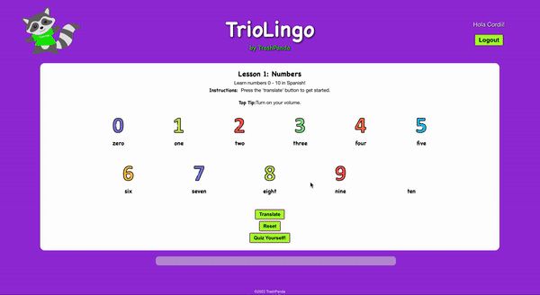

# JavaScript Project - React App 

**Group:** Tanya, Claire, Elisol, Cordii (aka Trash Panda)

**Project:** TrioLingo 

## Project Brief:

An Educational language game prototype to teach children spanish - TrioLingo

### MVP:
- Three lessons each with one quiz
    - Colours: drag and drop
    - Animals: english sentences with spanish words
    - Numbers: animation on hover/click 
- Quiz: 5 questions each with three possible answers (select with radio button)
- One final language game: Memory Card Game

### Extension:
- Progress bar
- Create own api for translations
- Users log in or sign up (retrieving their progress or starting from scratch) / guest user
- Storing users in database

## To Run App

Requires MongoDB (https://www.mongodb.com/docs/manual/tutorial/install-mongodb-on-os-x/)

- Clone respository
> npm install

- run Mongod 

- From inside server folder
- Seed the database:
> npm run seeds

- Run server
> npm run server:dev

- From inside client folder
> npm run

## App Running

- Log in and first lesson + quiz

